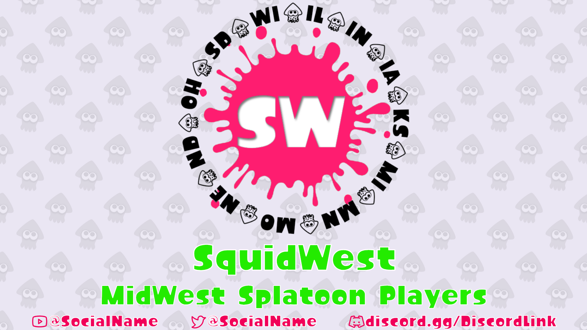
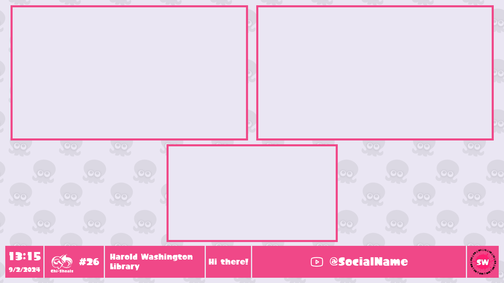
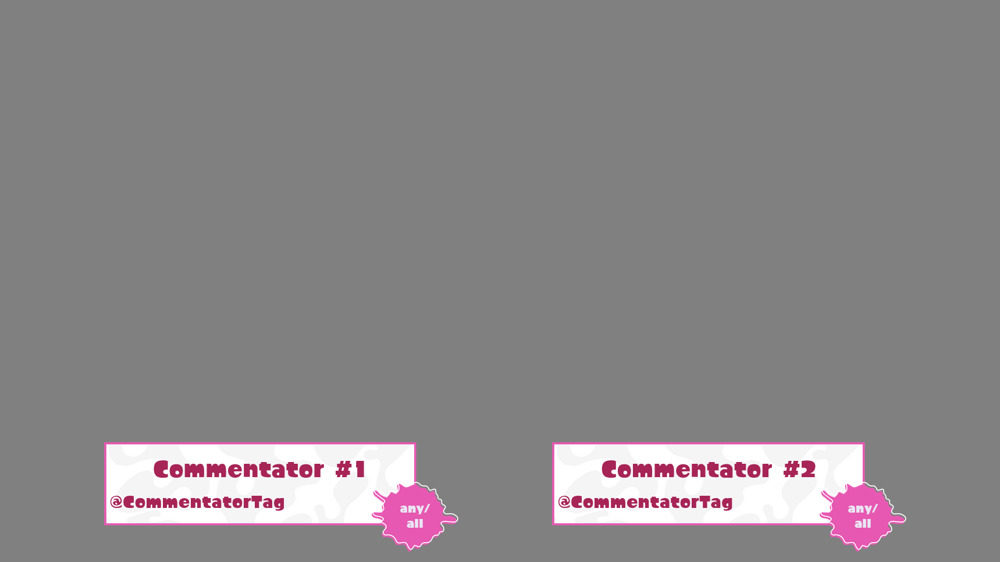
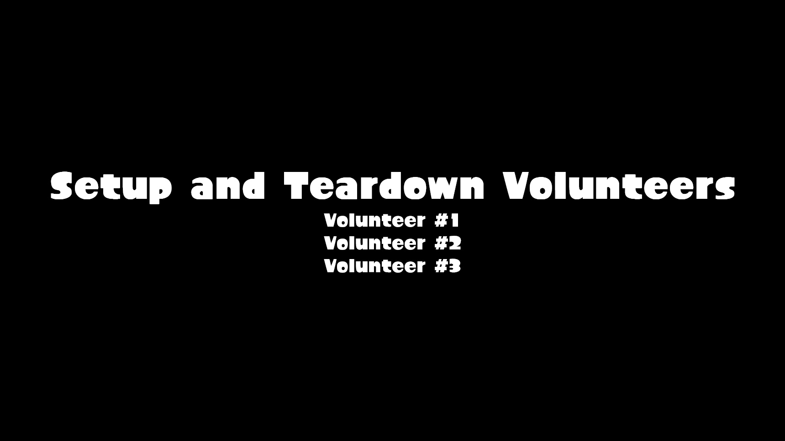

# chishoals-layouts

chishoals-layouts is a [NodeCG](http://github.com/nodecg/nodecg) bundle made for the Chi-Shoals Splatoon event, hosted by [SquidWest](https://bsky.app/profile/squidwest.bsky.social).

This repository contains the associated event graphics and must be used in tandem with [squidwest-layout-controls](https://github.com/EpicYoshiMaster/squidwest-layout-controls).

The graphics included are:

- Starting Soon scene
- Be Right Back scene
- Commentary Lower Thirds
- Omnibar
- Three Screen Intermission
- Credits sequence

The artwork for the commentary lower thirds was made by Xolo.

## Images

## Install

1. Complete the steps to obtain [NodeCG](https://www.nodecg.dev/) and [nodecg-cli](https://github.com/nodecg/nodecg-cli).

2. Install the bundle: `nodecg install EpicYoshiMaster/chishoals-layouts`.

## Support

If you like the things I make, consider supporting me on my ko-fi page: [https://ko-fi.com/epicyoshimaster](https://ko-fi.com/epicyoshimaster)!